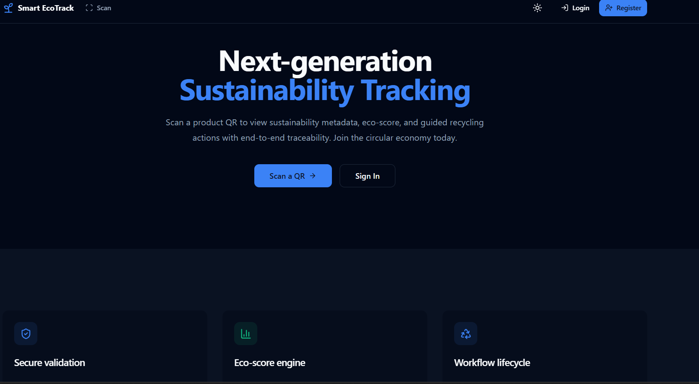
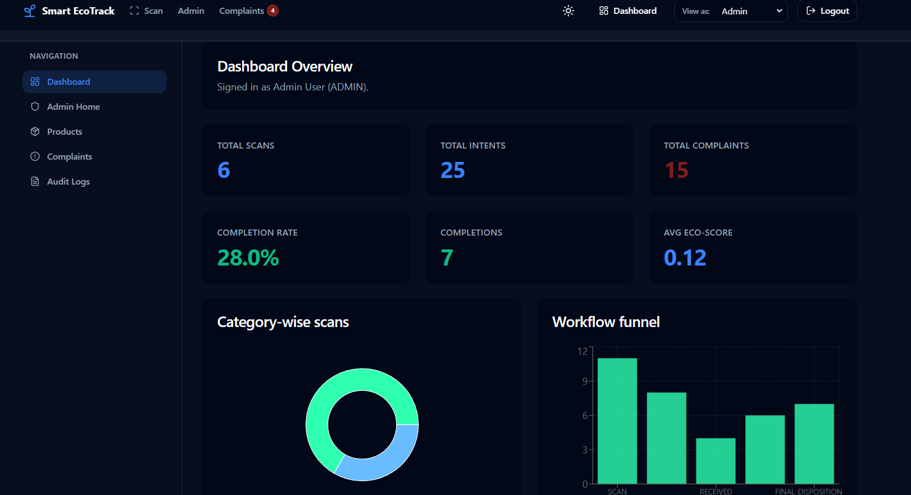
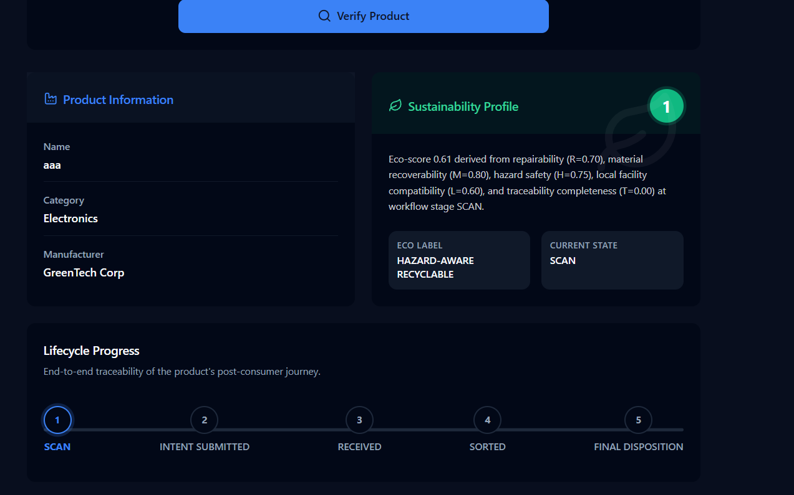

# 🚀 Smart EcoTrack – QR-Based Lifecycle & Recycling Platform

A full-stack platform that links physical products to secure QR codes, computes rule-based sustainability scores, and tracks recycling lifecycle events using a structured workflow system.

---

## 🌐 Live Demo

👉 https://smart-ecotrack.vercel.app/

---

## 📸 Screenshots

### 🧭 Landing Page



### 📊 Dashboard Analytics



### 📷 QR Scan & Eco Score


### 🔄 Lifecycle Workflow Tracking



---

## ⚡ Key Features

* Secure QR system using HMAC-SHA256 signature validation
* Multi-stage recycling workflow (Scan → Final Disposition)
* Eco-score engine with weighted sustainability metrics
* Role-based system (Admin, Manufacturer, Recycler, Consumer)
* Interactive dashboards with analytics and insights
* RESTful API architecture with validation and rate limiting

---

## 🏗️ Architecture

Frontend → API → Services → Repositories → PostgreSQL

```
client/   → React (Vite + TypeScript)
server/   → Node.js + Express (TypeScript)
```

---

## 🛠️ Tech Stack

Frontend: React, TypeScript, Tailwind CSS, Recharts
Backend: Node.js, Express, Zod
Database: PostgreSQL (Knex.js)
Security: JWT, bcrypt, HMAC-SHA256
DevOps: Docker, Nginx

---

## 🔐 QR Security Model

* Signed payload using HMAC-SHA256
* Expiry validation and revocation checks
* Scan logging and rate limiting
* Prevents tampering and replay attacks

---

## ♻️ Workflow State Machine

SCAN → INTENT → RECEIVED → SORTED → FINAL

* Enforced transitions
* Role-based permissions
* Invalid transitions return 409

---

## 📊 Eco Score Formula

Se = 0.25R + 0.25M + 0.20H + 0.15L + 0.15T

---

## ⚙️ Quick Start (Docker)

```bash
docker compose up --build
```

* Starts PostgreSQL
* Runs migrations and seed data
* Launches backend and frontend

---

## 🧪 Testing

```bash
cd server
npm run test
```

---

## 📌 Highlights

* Designed 10+ REST API endpoints
* Processes 100+ lifecycle events
* Implements real-world workflow engine
* Built using scalable layered architecture

---

## 🚀 Deployment

* Frontend: Vercel
* Backend: Render / Railway
* PostgreSQL with environment configuration

---

## 👤 Author

Yadwinder Singh
https://github.com/YADWINDER1234
